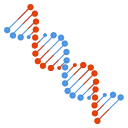

<!-- markdownlint-disable -->
<h1 align="center">
    <!-- ⚛️🧬❄️,  🤖🧠🦾✨, ▶️⏩➡️↔️🔄🔁♻️-->    
    Best of Atomistic Machine Learning 
     
</h1>

    <!-- Note: For image preview, use path relative to source file, config/header.md. For production, use path relative to README.md. -->
    <!-- Either only Atom + NN, or NN + Atom, DNA, Crystal, standing for materials & molecules -->
    
           
    <!--  -->
    <!--  -->

    

    <strong>🏆&nbsp; A ranked list of awesome atomistic machine learning (AML) projects. Updated quarterly.</strong>

    
    
    
    

This curated list contains {project_count} awesome open-source projects with a total of {stars_count} stars grouped into {category_count} categories. All projects are ranked by a [project-quality score](https://github.com/best-of-lists/best-of-generator#project-quality-score), which is calculated based on various metrics automatically collected from GitHub and different package managers. If you like to add or update projects, feel free to open an [issue](https://github.com/JuDFTteam/best-of-atomistic-machine-learning/issues/new/choose), submit a [pull request](https://github.com/JuDFTteam/best-of-atomistic-machine-learning/pulls), or directly edit the [projects.yaml](https://github.com/JuDFTteam/best-of-atomistic-machine-learning/edit/main/projects.yaml).

The current focus of this list is more on simulation data rather than experimental data, and more on materials rather than molecules. Nevertheless, contributions from other fields are warmly welcome!

> 🧙‍♂️  Discover other [best-of lists](https://best-of.org) or [create your own](https://github.com/best-of-lists/best-of/blob/main/create-best-of-list.md).
